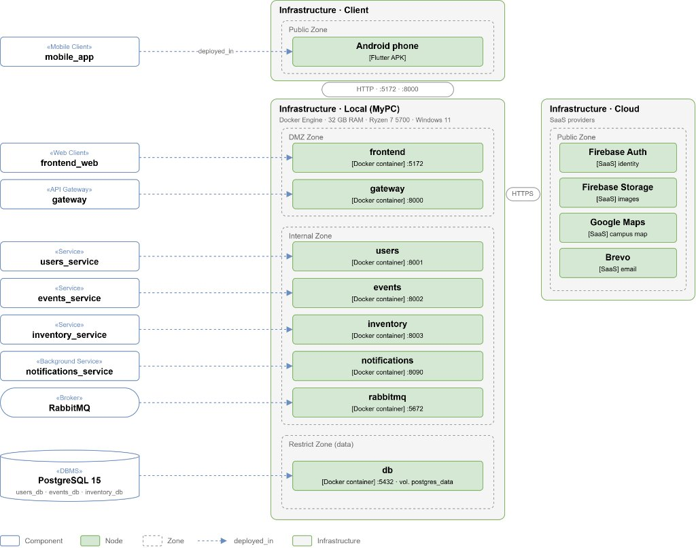
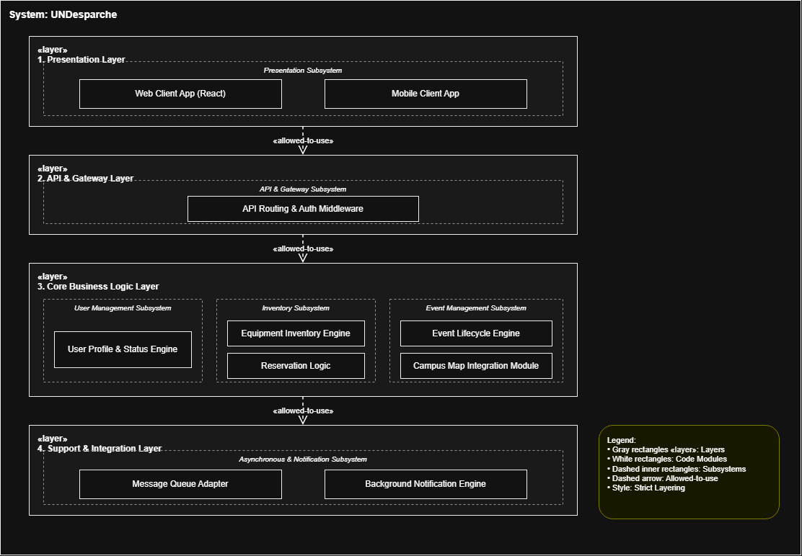

# UNDesparche: Prototipo 2

**Presentado por:**

-   Deibyd Santiago Barragan Gaitan - dbarragang@unal.edu.co
-   Jacobo Alzate Corredor - jalzateco@unal.edu.co
-   Víctor Camilo Cañón Castellanos - vcanonc@unal.edu.co
-   David Santiago Velasquez Gomez - dvelasquezg@unal.edu.co

**Docente:**

Santiago Suarez Suarez - ssuarez@unal.edu.co

Universidad Nacional de Colombia\
Facultad de Ingeniería\
Departamento de Ingeniería de Sistemas e Industrial\
2026

## Índice

-   [Contexto](#contexto)
-   [Alcance del proyecto](#alcance-del-proyecto)
-   [Funcionalidades principales del
    sistema](#funcionalidades-principales-del-sistema)
    -   [Características principales para el administrador del
        sistema](#características-principales-para-el-administrador-del-sistema)
    -   [Características principales para el administrador de
        eventos](#características-principales-para-el-administrador-de-eventos)
    -   [Características principales para el administrador de
        implementos](#características-principales-para-el-administrador-de-implementos)
    -   [Características principales para el
        miembro](#características-principales-para-el-miembro)
-   [Caracterización de actores](#caracterización-de-actores)
-   [Caracterización de entidades](#caracterización-de-entidades)
-   [Reglas de negocio](#reglas-de-negocio)
-   [Requerimientos funcionales](#requerimientos-funcionales)
-   [Requerimientos no funcionales](#requerimientos-no-funcionales)
    -   [Seguridad](#seguridad)
    -   [Rendimiento](#rendimiento)
    -   [Escalabilidad](#escalabilidad)
    -   [Disponibilidad](#disponibilidad)
    -   [Mantenibilidad](#mantenibilidad)
    -   [Portabilidad](#portabilidad)
    -   [Usabilidad](#usabilidad)
    -   [Interoperabilidad](#interoperabilidad)
    -   [Calidad](#calidad)
    -   [Concurrencia](#concurrencia)
-   [Arquitectura del sistema](#arquitectura-del-sistema)
    -   [Estructura de Componentes y Conectores (C&C)](#estructura-de-componentes-y-conectores-c-c)
    -   [Diagrama C&C](#diagrama-c-c)
    -   [Descripción de componentes](#descripción-de-componentes)
    -   [Interfaces y mecanismos de comunicación](#interfaces-y-mecanismos-de-comunicación)
    -   [Escenarios de interacción](#escenarios-de-interacción)
    -   [Vista de Despliegue](#vista-de-despliegue)
        -   [Diagrama de Despliegue](#diagrama-de-despliegue)
        -   [Descripción de elementos y relaciones](#descripción-de-elementos-y-relaciones)
        -   [Descripción de patrones arquitecturales](#descripción-de-patrones-arquitecturales)
        -   [Infraestructura y comunicaciones](#infraestructura-y-comunicaciones)
    -   [Estructura por capas (Layered Structure)](#estructura-por-capas-layered-structure)
        -   [Diagrama de capas](#diagrama-de-capas)
        -   [Descripción de las capas](#descripción-de-las-capas)
        -   [Organización de módulos por capa](#organización-de-módulos-por-capa)
        -   [Reglas de dependencia](#reglas-de-dependencia)
-   [Guía de Despliegue y Ejecución](#guía-de-despliegue-y-ejecución)
    -   [Requisitos previos](#requisitos-previos)
    -   [Configuración de variables de entorno](#configuración-de-variables-de-entorno)
    -   [Ejecución de la infraestructura con Docker Compose](#ejecución-de-la-infraestructura-con-docker-compose)
    -   [Poblado y sembrado de la base de datos](#poblado-y-sembrado-de-la-base-de-datos)
    -   [Cuentas preconfiguradas para pruebas](#cuentas-preconfiguradas-para-pruebas)
    -   [Endpoints y puertos de acceso](#endpoints-y-puertos-de-acceso)
    -   [Ejecución de la aplicación móvil (Flutter)](#ejecución-de-la-aplicación-móvil-flutter)
    -   [Comandos útiles](#comandos-útiles)

### Descripción del proyecto

Este documento tiene como objetivo la recopilación, análisis y
especificación de los requerimientos de un sistema para la gestión de
eventos e implementos recreativos de la UNAL como proyecto de la materia
de Arquitectura de Software.

## Contexto

En la Universidad Nacional de Colombia, los estudiantes no cuentan con
un medio centralizado que les permita conocer las actividades y los
implementos recreativos disponibles dentro del campus. Como
consecuencia, muchos desconocen estos recursos y pierden oportunidades
de participación en espacios deportivos, culturales y recreativos.

Actualmente, la consulta de disponibilidad de implementos requiere
desplazarse físicamente a las distintas facultades, ya que no existe un
sistema que permita verificar esta información de manera remota. De
forma similar, la difusión de eventos se realiza principalmente a través
del correo institucional, lo que limita su alcance debido a la
saturación de mensajes que reciben los estudiantes.

A partir de esta situación, surge la necesidad de una solución que
centralice la información relacionada con implementos recreativos y
eventos, permitiendo su consulta, seguimiento y gestión de manera
eficiente. La propuesta plantea un sistema que facilite la visualización
de disponibilidad de implementos por facultad, así como la publicación y
consulta de eventos, integrando además mecanismos de notificación y
visualización geográfica dentro del campus.

UNDesparche está enfocado en el sector de la educación superior y la
gestión de bienestar institucional universitario. Su naturaleza consiste
en el desarrollo de una solución de software plataforma web orientada a
centralizar, promover y optimizar el acceso a actividades recreativas,
culturales y deportivas dentro de la Universidad Nacional de Colombia
(Sede Bogotá).

El sistema actúa como un puente directo entre las dependencias
administrativas de la universidad (facultades, áreas de deporte, cultura
y bienestar) y los estudiantes, resolviendo problemas de ineficiencia
logística en el préstamo presencial de implementos recreativos y fallas
en los canales masivos de comunicación institucional (correos no leídos,
carteleras físicas desactualizadas).

## Alcance del proyecto

Diseñar y desarrollar una aplicación web para la gestión de eventos y de
implementos recreativos en la Universidad Nacional de Colombia, que
permita la administración de inventarios y la visualización de
disponibilidad de implementos, como también la gestión y consulta de
eventos.

El sistema incluirá funcionalidades de registro, actualización,
consulta, seguimiento y reserva de implementos y eventos, con control de
acceso basado en roles (administrador general, administrador de eventos,
administrador de implementos y estudiantes), limitado al uso dentro de
la comunidad universitaria mediante autenticación institucional para el
préstamo de implementos, mientras que usuarios externos podrán
suscribirse a notificaciones de eventos sin autenticarse.

## Funcionalidades principales del sistema

A continuación, se enlistan las características y funcionalidades
proyectadas para el software, segmentadas por los roles que tendrá el
sistema:

### Características principales para el administrador del sistema

1.  **Gestión de usuarios:** El sistema permitirá crear, consultar y
    eliminar los datos de los usuarios registrados, asignarles un rol
    (Administrador del sistema, Administrador de eventos, Administrador
    de implementos, Miembros de la comunidad) y darle los permisos
    referentes a su rol.
2.  **Gestión de eventos:** Permite supervisar y gestionar todos los
    eventos registrados en el sistema, incluyendo su creación,
    modificación y eliminación en caso necesario.
3.  **Gestión de implementos:** Permite supervisar y administrar el
    inventario general de implementos recreativos registrados por las
    distintas facultades.
4.  **Gestión de cuentas:** El administrador del sistema puede bloquear
    cuentas por actividades indebidas.

### Características principales para el administrador de eventos

1.  **Gestión de eventos:** El administrador de eventos podrá crear,
    consultar, modificar y eliminar eventos (que haya creado antes de
    ser publicados), definiendo atributos como nombre, estado (por
    hacerse, en ejecución, cancelado, realizado), descripción, lugar,
    fecha y hora, categoría, entre otros.
2.  **Publicación de eventos:** El administrador de eventos podrá
    publicar los eventos para que sean visibles a los demás usuarios del
    sistema.

### Características principales para el administrador de implementos

1.  **Gestión de implementos:** El administrador de implementos podrá
    registrar, actualizar, eliminar y consultar implementos recreativos
    asociados a su respectiva facultad.
2.  **Gestión de disponibilidad:** El administrador de implementos podrá
    actualizar el estado de disponibilidad de los implementos.
3.  **Gestión de reservas:** El administrador de implementos podrá
    validar y gestionar las solicitudes de reserva realizadas por los
    estudiantes.

### Características principales para el miembro

Nota: llamaremos "miembro" al usuario registrado en la plataforma con
correo UNAL (@unal.edu.co).

1.  **Consulta de implementos:** El miembro podrá consultar el catálogo
    de implementos por facultades y verificar su disponibilidad.
2.  **Suscripción y notificaciones:** El miembro podrá realizar
    suscripciones a eventos o implementos y recibir notificaciones sobre
    cambios relevantes.
3.  **Reserva de implementos:** El miembro podrá realizar reservas
    temporales de implementos disponibles por un tiempo determinado.

## Caracterización de actores

| Actor | Descripción | Rango de Edad | Género | Gustos / Intereses | Discapacidad |
|---|---|---|---|---|---|
| Miembro de la Comunidad | Estudiantes, docentes o administrativos con correo @unal.edu.co que usan el sistema para consultar y reservar eventos e implementos | 15 – 100 años | Todos los géneros | Deportes, videojuegos, música, integración social, cultura y bienestar. | Puede presentar discapacidades motrices o visuales (el sistema NO implementará accesibilidad). |
| Administrador de Eventos | Estudiante, docente o funcionario administrativo encargado de proponer, publicar y gestionar la logística de eventos culturales o deportivos. | 18 – 65 años | Todos los géneros | Liderazgo estudiantil, difusión cultural, coordinación logística y animación de espacios públicos. | Puede presentar discapacidades motrices o visuales (el sistema NO implementará accesibilidad). |
| Administrador de Implementos | Funcionario de Bienestar Universitario o estudiante auxiliar del inventario y control físico de los implementos deportivos en las facultades. | 18 – 65 años | Todos los géneros | Control de inventarios, servicio al cliente, deportes y gestión administrativa. | Puede presentar discapacidades motrices o visuales (el sistema NO implementará accesibilidad). |
| Administrador del Sistema | Ingeniero de soporte encargado de supervisar los logs de auditoría, gestionar permisos globales de acceso y garantizar la operación técnica. | 22 – 60 años | Todos los géneros | Ciberseguridad, administración de bases de datos y optimización de software. | Puede presentar discapacidades motrices o visuales (el sistema NO implementará accesibilidad). |

## Caracterización de entidades

A continuación, se estructuran las características técnicas de los
elementos principales del dominio de software.

### 1. Miembros de la Comunidad (Usuarios)

-   **Descripción:** Entidad que tiene los datos de todas las personas
    registradas con credenciales institucionales (correo @unal.edu.co =
    Miembro de la Comunidad , Administrador de Eventos, Administrador de
    Implementos, Administrador del Sistema).
-   **Propiedades:** id_usuario, nombre completo, correo institucional
    (@unal.edu.co), facultad, rol (Valores permitidos: Miembro de la
    Comunidad , Administrador de Eventos, Administrador de Implementos,
    Administrador del Sistema), estado del usuario (Valores permitidos:
    Activo, Sancionado)., fecha_registro.

### 2. Evento

-   **Descripción:** Actividad con un objetivo concreto programada
    dentro de los límites geográficos del campus universitario. Pueden
    asistir tanto Miembros de la Comunidad universitaria como externos
    (personas sin correo @unal.edu.co), creada por un Administrador de
    Eventos.
-   **Propiedades:** id_evento, nombre del evento, descripción,
    publicado, lugar, fecha y hora de inicio, fecha y hora de fin,
    organizador, estado del evento (Valores permitidos: Programado, En
    Curso, Finalizado, Cancelado), categoría temática (Valores
    permitidos: Académico, Cultural, Deportivo, Asamblea, Parche, Otro),
    imagen.

### 3. Implemento

-   **Descripción:** Objeto, material recreativo o artículo deportivo de
    propiedad de la universidad, disponible en las facultades para
    préstamo a los Miembros de la Comunidad.
-   **Propiedades:** id_implemento, nombre del artículo, categoría
    (Valores permitidos: Balones, Raquetas, Mesas, Juegos recreativos,
    Juegos de mesa, otros), facultad propietaria, estado del implemento
    (valores permitidos: Disponible, No Disponible, Reservado,
    Prestado), descripción, imagen.

## Reglas de negocio

**RN-01 (Autenticación Exclusiva):** El sistema restringirá el registro
e inicio de sesión exclusivamente a usuarios que utilicen una cuenta con
dominio institucional (@unal.edu.co). Cualquier solicitud proveniente de
un dominio distinto será rechazada de manera automática.

**RN-02 (Vigencia Temporal de Reservas):** Al solicitar la reserva de un
implemento en estado "Disponible", su estado cambiará a "Reservado" y el
Miembro de la Comunidad dispondrá de un plazo improrrogable de diez (10)
minutos para realizar su retiro presencial en la facultad
correspondiente. Transcurrido dicho lapso sin la confirmación del
préstamo, el sistema cancelará la reserva y reajustará el estado del
implemento a "Disponible".

**RN-03 (Sanción por Daño o Deterioro de Implementos):** Si un
implemento es devuelto con daños o averías, el Administrador de
Implementos registrará la novedad, modificando el estado del Miembro de
la Comunidad de "Activo" a "Sancionado" y el del implemento a "No
Disponible". Esta sanción inhabilitará al usuario para realizar nuevas
reservas hasta que se efectúe el pago correspondiente o la reparación de
los daños causados.

**RN-04 (Exclusividad de Gestión por Facultad):** Un usuario únicamente
podrá gestionar o modificar la información de un implemento si cuenta
con el rol de Administrador de Implementos y el artículo pertenece
formalmente a la misma facultad registrada en su perfil.

**RN-05 (Límite de Reservas Simultáneas):** Un Miembro de la Comunidad
podrá tener registrado un máximo de un (1) implemento simultáneamente
bajo los estados "Reservado" o "Prestado" en todo el sistema.

## Requerimientos funcionales

Todo lo referente al que debe hacer la aplicación para cumplir sus
funcionalidades principales de manera óptima, satisfaciendo las
necesidades del cliente.

**RF-1.** El sistema debe permitir el registro e inicio de sesión de
usuarios mediante autenticación exclusiva con cuentas de correo
institucionales (@unal.edu.co) a través de Google.

**RF-2.** El sistema debe manejar los siguientes roles de usuario:
Administrador del sistema, Administrador de eventos, Administrador de
implementos y Miembro de la comunidad.

**RF-3.** El sistema debe permitir a todos los usuarios visualizar los
eventos públicos en un mapa interactivo del campus universitario.

**RF-4.** El sistema debe permitir filtrar todos los eventos por
categoría temática (Académico, Cultural, Deportivo, Asamblea, Parche,
Otro) y estado (Programado, En Curso, Finalizado, Cancelado).

**RF-5.** El sistema debe permitir ordenar el listado de eventos por
fecha y hora de inicio.

**RF-6.** El sistema debe permitir filtrar el catálogo de implementos
por categoría (Balones, Raquetas, Mesas, Juegos recreativos, Juegos de
mesa, otros).

**RF-7.** El sistema debe permitir a usuarios no registrados suscribirse
a las notificaciones de un evento específico ingresando una dirección de
correo electrónico válida.

**RF-8.** El sistema debe enviar notificaciones automáticas por correo
electrónico a los usuarios suscritos a un evento cuando ocurran cambios
relevantes en el mismo (modificación de lugar, fecha, hora o
cancelación).

**RF-9.** El sistema debe permitir a los miembros de la comunidad
consultar el catálogo completo e inventario de implementos recreativos
filtrados por facultad propietaria y verificar su estado de
disponibilidad (Disponible, No Disponible, Reservado, Prestado).

**RF-10.** El sistema debe mostrar un aviso de descargo de
responsabilidad antes de solicitar la reserva de cualquier implemento.

**RF-11.** El sistema debe permitir la reserva de un implemento
únicamente si el usuario está con estado Activo y acepta expresamente el
aviso de descargo de responsabilidad.

**RF-12.** El sistema debe permitir a los miembros de la comunidad
autenticados realizar la reserva temporal de un implemento en estado
"Disponible", cambiando su estado a "Reservado" por un plazo
improrrogable de diez (10) minutos para su retiro físico.

**RF-13.** El sistema debe cancelar automáticamente la reserva y cambiar
el estado del implemento de vuelta a "Disponible" si el plazo de diez
(10) minutos expira sin que el préstamo haya sido confirmado por el
Administrador de Implementos.

**RF-14.** El sistema debe validar y restringir que un miembro de la
comunidad sólo tenga máximo un (1) implemento activo simultáneamente
bajo el estado "Reservado" o "Prestado".

**RF-15.** El sistema debe permitir a los miembros de la comunidad
autenticados suscribirse a eventos para recibir notificaciones.

**RF-16.** El sistema debe permitir a los administradores de eventos
registrar eventos en el sistema especificando nombre, descripción,
lugar, fecha/hora de inicio, fecha/hora de fin, categoría temática y
opcionalmente una imagen asociada.

**RF-17.** El sistema debe guardar los eventos creados inicialmente en
estado de borrador (no publicado), impidiendo su visualización pública
hasta que su creador decida publicarlo.

**RF-18.** El sistema debe permitir a los administradores de eventos
publicar los eventos de su autoría para hacerlos visibles a la
comunidad.

**RF-19.** El sistema debe permitir a los administradores de eventos
modificar la información de los eventos creados por ellos.

**RF-20.** El sistema debe permitir a los administradores de eventos
cancelar los eventos creados por ellos cambiando su estado a
"Cancelado".

**RF-21.** El sistema debe impedir la eliminación física de eventos que
ya hayan sido publicados para preservar el historial del sistema.

**RF-22.** El sistema debe permitir a los administradores de implementos
registrar, consultar, modificar y eliminar físicamente implementos
recreativos asociados de manera exclusiva a su facultad registrada.

**RF-23.** El sistema debe permitir al administrador de implementos
gestionar el estado de los implementos de su facultad (Disponible, No
Disponible, Reservado, Prestado).

**RF-24.** El sistema debe permitir a los administradores de implementos
validar y procesar las solicitudes de reserva de implementos
pertenecientes a su facultad.

**RF-25.** El sistema debe permitir al administrador de implementos
reportar la entrega de un implemento dañado, cambiando automáticamente
el estado del usuario de "Activo" a "Sancionado" y el del implemento a
"No Disponible", restringiendo futuras reservas del usuario sancionado.

**RF-26.** El sistema debe permitir al administrador del sistema
consultar la lista completa de usuarios registrados mostrando su
id_usuario, nombre completo, correo institucional, facultad, rol, estado
(Activo, Sancionado) y fecha de registro.

**RF-27.** El sistema debe permitir al administrador del sistema buscar
usuarios por nombre completo o correo institucional y filtrarlos por rol
y estado actual.

**RF-28.** El sistema debe permitir al administrador del sistema asignar
o revocar roles de usuario, exceptuando la modificación sobre otros
administradores del sistema.

**RF-29.** El sistema debe permitir al administrador del sistema
bloquear o sancionar cuentas de usuario ante faltas cometidas y eliminar
usuarios registrados (excepto a otros administradores del sistema).

**RF-30.** El sistema debe permitir al administrador del sistema
supervisar, consultar, modificar o eliminar cualquier evento o
implemento registrado en la plataforma independientemente de la facultad
u organizador.

## Requerimientos no funcionales

El cómo la aplicación debe cumplir sus funcionalidades principales de
manera que satisfaga las necesidades del cliente y a su vez no presente
errores.

### Seguridad

**RNF-1.** El sistema debe integrar la plataforma Firebase
Authentication para autenticar a los usuarios de manera segura mediante
sus cuentas institucionales de Google.

**RNF-2.** El sistema debe finalizar automáticamente la sesión activa
del usuario tras detectar diez (10) minutos continuos de inactividad.

### Rendimiento

**RNF-3.** El tiempo de respuesta para la consulta de disponibilidad de
inventario y la carga del mapa interactivo no debe superar los dos (2)
segundos bajo condiciones normales de red.

**RNF-4.** El backend debe implementar un mecanismo de almacenamiento en
caché para las peticiones de alta frecuencia, optimizando la velocidad
de respuesta y reduciendo la carga sobre la base de datos.

### Escalabilidad

**RNF-5.** El sistema debe ser desplegado en contenedores Docker
independientes para la interfaz de usuario (frontend) y sus respectivos
microservicios o servicios de soporte.

**RNF-6.** La arquitectura del sistema debe permitir la incorporación
modular de nuevas funcionalidades o servicios sin degradar ni alterar la
operación de los módulos existentes.

### Disponibilidad

**RNF-7.** Ante la ocurrencia de fallas controladas, el sistema debe
registrar el evento de excepción y garantizar la continuidad operativa
sin comprometer ni perder la información del usuario.

**RNF-8.** El sistema debe contar con un proceso automatizado de
respaldo (backup) de la base de datos con una periodicidad semanal.

### Mantenibilidad

**RNF-9.** El código fuente debe apegarse al estándar de estilo PEP 8 e
implementar principios de Código Limpio (Clean Code) y patrones de
diseño reconocidos para favorecer su mantenibilidad.

**RNF-10.** El código fuente debe incluir documentación técnica clara
mediante comentarios e intencionados docstrings para clases, métodos y
módulos principales.

### Portabilidad

**RNF-11.** La aplicación web debe ser plenamente compatible y funcional
en las últimas dos versiones principales del navegador Google Chrome.

### Usabilidad

**RNF-12.** La interfaz gráfica de usuario debe contar con un diseño
adaptable (responsive) para su correcta visualización en diversos
dispositivos.

**RNF-13.** La navegación debe estructurarse de modo que el usuario
pueda acceder a cualquier funcionalidad principal en un máximo de cinco
(5) clics.

### Interoperabilidad

**RNF-14.** El sistema debe integrarse con Google Maps Platform para
visualizar de forma precisa la ubicación geográfica de los eventos en el
campus.

**RNF-15.** El sistema debe utilizar un servicio externo especializado
para el envío seguro y confiable de notificaciones por correo
electrónico.

### Calidad

**RNF-16.** El sistema debe incluir contar con pruebas unitarias que
cubra la lógica de los módulos principales.

**RNF-17.** El desarrollo debe emplear herramientas de análisis estático
de código (linters) para identificar y corregir posibles defectos
durante la fase de construcción.

### Concurrencia

**RNF-18.** El sistema debe prevenir condiciones de carrera para
garantizar la integridad de los datos, asegurando que un mismo
implemento no pueda ser reservado por más de un usuario simultáneamente.

**RNF-19.** La aplicación debe soportar de manera concurrente cerca de
400 usuarios a cualquier hora del día, funcionando de lunes a domingo
las 24 horas del día durante el periodo académico establecido por el
Consejo Universitario.

---

# Arquitectura del sistema

## Estructura de Componentes y Conectores (C&C)

### Diagrama C&C

El diagrama muestra dos clientes, un gateway, tres servicios de dominio, sus bases de datos, un sistema de mensajería y los servicios externos de autenticación, mapas, almacenamiento y correo.


### Descripción de componentes

| Componente | Responsabilidad |
|---|---|
| **ReactWebPage** | Interfaz web desarrollada en React. Se comunica con el Gateway, Firebase Authentication y Google Maps. |
| **FlutterMobileApp** | Aplicación móvil desarrollada en Flutter. Utiliza las mismas integraciones que el cliente web. |
| **APIGateway** | API desarrollada con FastAPI. Valida los ID Tokens de Firebase y encamina las solicitudes a los servicios de dominio. Añade a las solicitudes internas el contexto del usuario mediante encabezados. No contiene lógica de negocio ni sustituye la autorización de cada servicio. Mantiene en memoria una caché de datos de usuario con TTL de 60 segundos; la validación del token se realiza en cada solicitud protegida. |
| **Users** | Servicio desarrollado con Django REST Framework. Gestiona usuarios, roles y estados. Comprueba la identidad recibida del Gateway consultando su propia base de datos. |
| **Events** | Servicio desarrollado con Django REST Framework. Gestiona eventos y suscripciones. Persiste los datos en `EventsDB` y utiliza Firebase Storage para las imágenes. Aplica los permisos de las operaciones sobre eventos. |
| **Inventory** | Servicio desarrollado con Django REST Framework. Gestiona implementos, disponibilidad, reservas y préstamos. Persiste los datos en `Inventory DB` y utiliza Firebase Storage para las imágenes. Aplica las reglas de autorización del inventario. |
| **UsersDB**, **EventsDB**, **Inventory DB** | Bases de datos PostgreSQL independientes, una para cada servicio de dominio. Los servicios acceden a ellas mediante Django ORM. |
| **NotificationsQueue** | Cola de mensajes implementada con RabbitMQ. Recibe mensajes publicados por `Events` e `Inventory` y los entrega al consumidor. |
| **Notifications** | Servicio independiente desarrollado con FastAPI. Consume mensajes de RabbitMQ, construye los correos y solicita su envío a Brevo. |
| **FirebaseAuth** | Proveedor externo de autenticación. Los clientes obtienen ID Tokens que el Gateway valida en las solicitudes protegidas. |
| **GoogleMapsAPI** | Servicio externo de mapas, utilizado directamente por los clientes para mostrar ubicaciones. |
| **Firebase Storage** | Almacenamiento externo utilizado por `Events` e `Inventory` para las imágenes de eventos e implementos. |
| **Brevo** | Servicio externo utilizado por `Notifications` para el envío de correos electrónicos. |

### Interfaces y mecanismos de comunicación

Cada conexión del diagrama enlaza los puertos indicados en la tabla. Los mecanismos corresponden al protocolo o tecnología utilizada en esa comunicación.

| Origen | Puerto de salida | Destino | Puerto de entrada | Mecanismo |
|---|---|---|---|---|
| `ReactWebPage` | `fbAuthPt` | `FirebaseAuth` | `authPt` | SDK de Firebase sobre HTTPS |
| `FlutterMobileApp` | `fbAuthPt` | `FirebaseAuth` | `authPt` | SDK de Firebase sobre HTTPS |
| `ReactWebPage` | `apiPt` | `APIGateway` | `webApiPt` | HTTP |
| `FlutterMobileApp` | `apiPt` | `APIGateway` | `mobileApiPt` | HTTP |
| `ReactWebPage` | `mapsPt` | `GoogleMapsAPI` | `apiPt` | API de Google Maps sobre HTTPS |
| `FlutterMobileApp` | `mapsPt` | `GoogleMapsAPI` | `apiPt` | API de Google Maps sobre HTTPS |
| `APIGateway` | `usersPt` | `Users` | `apiPt` | HTTP |
| `APIGateway` | `eventsPt` | `Events` | `apiPt` | HTTP |
| `APIGateway` | `invPt` | `Inventory` | `apiPt` | HTTP |
| `Users` | `usersDbPt` | `UsersDB` | `queryPt` | Django ORM / conexión PostgreSQL |
| `Events` | `eventsDbPt` | `EventsDB` | `queryPt` | Django ORM / conexión PostgreSQL |
| `Inventory` | `invDbPt` | `Inventory DB` | `queryPt` | Django ORM / conexión PostgreSQL |
| `Events` | `fbStgPt` | `Firebase Storage` | `objStgPt` | API de Firebase Storage |
| `Inventory` | `fbStgPt` | `Firebase Storage` | `objStgPt` | API de Firebase Storage |
| `Events` | `ntfsPt` | `NotificationsQueue` | `prodPt` | AMQP, publicación de mensajes |
| `Inventory` | `ntfsPt` | `NotificationsQueue` | `prodPt` | AMQP, publicación de mensajes |
| `NotificationsQueue` | `conPt` | `Notifications` | `queuePt` | AMQP, consumo de mensajes |
| `Notifications` | `brevoPt` | `Brevo` | `emailApiPt` | API HTTP de Brevo |

En las solicitudes protegidas, los clientes envían el ID Token en `Authorization: Bearer <token>`. El Gateway lo valida y transmite la identidad del usuario a los servicios mediante los encabezados `X-From-Gateway`, `X-User-Id`, `X-User-Email`, `X-User-Role`, `X-User-Faculty` y `X-User-Status`. El token de Firebase no se reenvía. Las solicitudes públicas pueden llegar sin contexto de usuario.

El Gateway encamina las solicitudes HTTP, pero cada servicio aplica sus propios permisos. `Users` reconstruye el usuario consultando `UsersDB`; `Events` e `Inventory` utilizan el contexto recibido para evaluar sus reglas de acceso.

Las tareas periódicas previstas en `Events` e `Inventory` revisarán, aproximadamente cada 30 segundos, condiciones temporales o cambios de estado que puedan generar notificaciones. Cuando corresponda, publicarán un mensaje en RabbitMQ. `Notifications` consume los mensajes de forma continua y llama a la API de Brevo para solicitar el envío del correo.

**Consideración de seguridad:** el encabezado `X-From-Gateway: true` no autentica criptográficamente al emisor. La comunicación interna debe restringirse a los componentes autorizados y requiere un mecanismo de autenticación entre servicios para evitar la falsificación de encabezados.

### Escenarios de interacción

#### 1. Autenticación y solicitud protegida

1. El cliente se autentica directamente con `FirebaseAuth` y obtiene un ID Token.
2. Envía la solicitud al Gateway con el token en el encabezado `Authorization`.
3. El Gateway valida el token y obtiene el identificador del usuario (`firebase_uid`).
4. Si no tiene datos vigentes en caché, consulta a `Users`; si el usuario no existe, solicita su creación.
5. El Gateway añade los encabezados de contexto y reenvía la solicitud al servicio correspondiente.
6. El servicio verifica los permisos, ejecuta la operación y devuelve la respuesta a través del Gateway.

#### 2. Consulta y visualización de eventos

1. El cliente solicita los eventos al Gateway.
2. El Gateway reenvía la solicitud a `Events`.
3. `Events` consulta `EventsDB` y devuelve los eventos correspondientes.
4. El cliente utiliza los datos de ubicación para mostrarlos mediante `GoogleMapsAPI`, sin pasar por el Gateway.

#### 3. Cambio de evento y envío de correo

1. El cliente envía al Gateway una solicitud para crear o modificar un evento.
2. El Gateway valida la identidad y remite la solicitud a `Events`.
3. `Events` verifica los permisos y guarda los cambios en `EventsDB`.
4. Si el cambio requiere notificaciones, `Events` publica un mensaje en `NotificationsQueue` mediante AMQP.
5. `Notifications` consume el mensaje y solicita a Brevo el envío del correo mediante su API.

#### 4. Reserva y vencimiento de un implemento

1. El cliente solicita a `Inventory` la disponibilidad de un implemento.
2. `Inventory` consulta `Inventory DB` y, al recibir una solicitud de reserva, verifica las reglas correspondientes, incluido el límite de un implemento reservado o prestado por miembro.
3. Si se cumplen las condiciones, registra la reserva, que debe confirmarse en un plazo de diez minutos.
4. La tarea periódica prevista detecta las reservas vencidas, las cancela y restablece la disponibilidad del implemento.
5. Si corresponde enviar una notificación, `Inventory` publica el mensaje en RabbitMQ para que `Notifications` lo procese y solicite el envío a Brevo.

---

## Vista de Despliegue

### Diagrama de Despliegue



### Descripción de elementos y relaciones

La vista asigna cada componente de la vista C&C al elemento del entorno donde se ejecuta, mediante la relación `deployed_in`. El diagrama representa el entorno local, que es el que se usa en este prototipo.

En la infraestructura **Local (MyPC)** cada componente corre en su propio nodo, un contenedor Docker. Frontend, gateway, users, events, inventory y notifications son nodos de cómputo. RabbitMQ es un nodo de comunicación. El nodo de datos es db, un PostgreSQL 15 que guarda las tres bases de datos y las conserva en el volumen `postgres_data`. En la infraestructura **Client**, la app móvil corre en un teléfono Android como APK. En **Cloud** están los nodos externos: Firebase Auth, Firebase Storage, Google Maps y Brevo.

El teléfono llega al equipo por HTTP, usando la IP del PC en la red local y los puertos 5172 (frontend) y 8000 (gateway). Dentro del equipo los contenedores se comunican por nombre de servicio en la red interna que crea Docker Compose. Las llamadas hacia Cloud salen del equipo por HTTPS.

Todos los nodos locales dependen de un mismo equipo, así que si este falla el sistema completo se detiene. Si falla db, se detienen users, events e inventory. Si falla rabbitmq, dejan de enviarse correos, pero el resto del sistema sigue funcionando.

### Descripción de patrones arquitecturales

El despliegue está **orientado a contenedores**. Cada componente tiene su propia imagen y su propio contenedor, y `docker-compose.yml` los levanta juntos en un solo host. Así cada servicio se puede construir, reiniciar o reemplazar sin tocar a los demás.

Los nodos se organizan por zonas según quién puede alcanzarlos. Frontend y gateway están en la **DMZ** porque reciben el tráfico de los clientes, y el gateway es la única entrada a la API. Los servicios y el broker están en la zona **Internal**. La base de datos está en **Restrict**. Hoy esta separación es lógica, porque Compose publica los puertos de todos los contenedores.

### Infraestructura y comunicaciones

El modelo de despliegue es **híbrido**. Los componentes propios corren en la infraestructura Local (MyPC): un equipo con Windows 11, Ryzen 7 5700 y 32 GB de RAM, sobre Docker Engine. Autenticación, almacenamiento de imágenes, mapas y correo se consumen como SaaS desde la nube pública. La infraestructura Client es el teléfono del usuario, conectado a la misma red que el equipo.

---
## Estructura por capas (Layered Structure)

### Diagrama de capas



La organización parte de las tres categorías definidas en la descomposición. La categoría **Front-End & Gateway** se separa en dos capas, porque la interacción con el usuario y la entrada al backend tienen responsabilidades y niveles de abstracción diferentes. Las otras dos categorías corresponden cada una a una capa.

| Capa | Categoría de origen | Subsistemas | Componentes del C&C |
|---|---|---|---|
| **Presentation Layer** | Front-End & Gateway | Presentation Subsystem | `ReactWebPage`, `FlutterMobileApp` |
| **API & Gateway Layer** | Front-End & Gateway | API & Gateway Subsystem | `APIGateway` |
| **Core Business Logic Layer** | Core Business Logic | User Management, Inventory y Event Management | `Users`, `Inventory`, `Events` |
| **Support & Integration Layer** | Support & Integration Services | Asynchronous & Notification Subsystem | `NotificationsQueue` (interacción), `Notifications` |

### Descripción de las capas

#### Capa 1: Presentation Layer

Es la capa de mayor nivel de abstracción y la más cercana al usuario final. Contiene los clientes web y móvil con los que los miembros de la universidad consultan el catálogo de implementos, visualizan los eventos y sus ubicaciones, consultan la disponibilidad y realizan reservas.

Sus responsabilidades son renderizar las interfaces, capturar la interacción del usuario, gestionar el estado local de navegación y de la sesión, obtener el ID Token directamente desde `FirebaseAuth` y mostrar las ubicaciones de los eventos mediante `GoogleMapsAPI`.

No contiene reglas de negocio, no accede a las bases de datos y no se comunica directamente con los servicios de dominio. Todas las operaciones sobre usuarios, eventos, implementos y reservas se delegan a la API & Gateway Layer.

#### Capa 2: API & Gateway Layer

Actúa como punto único de entrada al backend y como frontera inicial de seguridad. Recibe las solicitudes HTTP de los clientes, valida el ID Token de Firebase en cada solicitud protegida y encamina cada petición al módulo de negocio correspondiente.

Para construir el contexto interno del usuario, añade los encabezados `X-From-Gateway`, `X-User-Id`, `X-User-Email`, `X-User-Role`, `X-User-Faculty` y `X-User-Status`. El token de Firebase no se reenvía a los servicios de dominio.

Mantiene en memoria una caché de datos de usuario con TTL de 60 segundos. Si la información no está vigente, consulta al módulo de usuarios; si el usuario no existe, solicita su creación.

No contiene lógica de negocio ni reemplaza la autorización propia de cada servicio. Se limita al enrutamiento, la validación de identidad y la transmisión del contexto del usuario.

#### Capa 3: Core Business Logic Layer

Contiene las reglas principales del dominio universitario y corresponde a la categoría Core Business Logic de la descomposición.

Administra los usuarios, roles y estados; controla el registro, la disponibilidad, la reserva y el préstamo de implementos; y gestiona el ciclo de vida de los eventos, sus suscripciones y sus datos de ubicación dentro del campus.

- Cada módulo aplica sus propios permisos a partir del contexto recibido del Gateway.
- Cada subsistema accede únicamente a su propia base de datos PostgreSQL mediante Django ORM: el módulo de usuarios utiliza `UsersDB`, los de eventos `EventsDB` y los de inventario `Inventory DB`.
- Los módulos de eventos e inventario gestionan también las imágenes de eventos e implementos con Firebase Storage.
- Aquí residen las reglas de reserva: el límite de un implemento reservado o prestado por miembro y la obligación de confirmar la reserva en un plazo de diez minutos.
- Las tareas periódicas previstas en `Events` e `Inventory` revisarán aproximadamente cada 30 segundos los cambios de estado o vencimientos que puedan generar notificaciones.

Esta capa no conoce cómo se construyen las interfaces ni cómo se envían los correos. Los mapas los muestran los clientes con `GoogleMapsAPI`; el Campus Map Integration Module solo estructura y procesa las coordenadas geográficas de los eventos.

#### Capa 4: Support & Integration Layer

Es la capa de menor nivel de abstracción y la más cercana a los mecanismos técnicos de infraestructura. Corresponde a la categoría Support & Integration Services de la descomposición. Su responsabilidad es proporcionar la comunicación asíncrona y el procesamiento en segundo plano que requiere la capa de negocio.

Los módulos de eventos e inventario no se comunican directamente con el servicio de notificaciones: publican mensajes mediante el Message Queue Adapter, con AMQP sobre RabbitMQ. Después, el Background Notification Engine consume los mensajes, construye los correos y solicita su envío a Brevo.

Este desacoplamiento evita que la lógica de negocio dependa del mecanismo de envío de correos y permite procesar las notificaciones sin bloquear la respuesta de los servicios de eventos e inventario.

Las bases de datos PostgreSQL, la cola RabbitMQ, Firebase Storage, `FirebaseAuth`, `GoogleMapsAPI` y Brevo no son módulos adicionales: son componentes de infraestructura o servicios externos representados en la vista C&C y utilizados desde los módulos ya definidos.

### Organización de módulos por capa

| Capa | Categoría de origen | Subsistema | Módulo | Responsabilidad | Componente C&C |
|---|---|---|---|---|---|
| Presentation Layer | Front-End & Gateway | Presentation Subsystem | Web Client App (React) | Renderizar el catálogo de implementos, el mapa de eventos y la interfaz de reservas. Gestionar el estado de la sesión en el navegador. | `ReactWebPage` |
| Presentation Layer | Front-End & Gateway | Presentation Subsystem | Mobile Client App | Proporcionar la interfaz móvil e integrar el SDK de autenticación en dispositivos móviles. | `FlutterMobileApp` |
| API & Gateway Layer | Front-End & Gateway | API & Gateway Subsystem | API Routing & Auth Middleware | Recibir y encaminar el tráfico de los clientes, validar los tokens de Firebase, construir el contexto del usuario y mantener la caché de usuarios con TTL de 60 segundos. No contiene lógica de negocio. | `APIGateway` |
| Core Business Logic Layer | Core Business Logic | User Management Subsystem | User Profile & Status Engine | Validar usuarios con correo institucional, administrar perfiles, roles y estados, y persistir la información en `UsersDB`. También comprueba la identidad recibida consultando su propia base de datos. | `Users` |
| Core Business Logic Layer | Core Business Logic | Inventory Subsystem | Equipment Inventory Engine | Registrar, actualizar, consultar y eliminar implementos; filtrarlos por categoría; controlar su disponibilidad y vincular sus imágenes en Firebase Storage. Persiste en `Inventory DB`. | `Inventory` |
| Core Business Logic Layer | Core Business Logic | Inventory Subsystem | Reservation Logic | Procesar reservas y préstamos, aplicar el límite de un implemento por miembro, activar el plazo de confirmación de diez minutos y cancelar reservas vencidas restableciendo la disponibilidad. | `Inventory` |
| Core Business Logic Layer | Core Business Logic | Event Management Subsystem | Event Lifecycle Engine | Crear, modificar y cancelar eventos; gestionar suscripciones y estados de publicación; aplicar los permisos correspondientes y persistir la información en `EventsDB`. | `Events` |
| Core Business Logic Layer | Core Business Logic | Event Management Subsystem | Campus Map Integration Module | Estructurar y procesar las coordenadas geográficas y los datos descriptivos de los eventos dentro del campus. | `Events` |
| Support & Integration Layer | Support & Integration Services | Asynchronous & Notification Subsystem | Message Queue Adapter | Recibir las publicaciones asíncronas de eventos e inventario mediante AMQP y almacenarlas en la cola para garantizar su entrega al consumidor. | Interacción con `NotificationsQueue` |
| Support & Integration Layer | Support & Integration Services | Asynchronous & Notification Subsystem | Background Notification Engine | Consumir los mensajes de la cola, construir los correos y solicitar su envío mediante Brevo. | `Notifications` |

**Aclaraciones sobre la organización**

- El servicio `Inventory` de la vista C&C está implementado por dos módulos: Equipment Inventory Engine y Reservation Logic.
- El servicio `Events` está implementado por Event Lifecycle Engine y Campus Map Integration Module.
- `NotificationsQueue` es un componente de infraestructura en tiempo de ejecución. El código que publica y consume sus mensajes está en los módulos Message Queue Adapter y Background Notification Engine.
- `UsersDB`, `EventsDB` e `Inventory DB` son bases de datos PostgreSQL independientes. Su acceso está encapsulado en los módulos de negocio correspondientes y no da lugar a nuevos módulos.
- `FirebaseAuth`, `GoogleMapsAPI`, Firebase Storage y Brevo son servicios externos, por lo que no forman una capa adicional.

### Reglas de dependencia

#### Reglas generales

**R1. Asignación única de módulos.** Cada módulo pertenece exactamente a una capa. Ningún módulo puede aparecer en dos capas ni se pueden incorporar módulos que no existan en la vista de descomposición.

**R2. Dependencia descendente.** La relación «allowed-to-use» fluye solo desde las capas superiores hacia las inferiores:

```text
Presentation Layer
        ↓
API & Gateway Layer
        ↓
Core Business Logic Layer
        ↓
Support & Integration Layer
```

**R3. Capas cerradas (strict layering).** Una capa solo puede utilizar la capa inmediatamente inferior; no se permite el salto de capas (*layer bridging*). Por ejemplo, Web Client App y Mobile Client App no pueden invocar directamente Event Lifecycle Engine, Equipment Inventory Engine ni Message Queue Adapter: todas sus solicitudes de negocio pasan por API Routing & Auth Middleware.

**R4. Prohibición de dependencias ascendentes.** Ningún módulo de una capa inferior puede importar, invocar o conocer módulos de una capa superior. Por ejemplo, Background Notification Engine no puede consultar a Event Lifecycle Engine ni a Reservation Logic: la información necesaria para construir una notificación debe venir en el mensaje que recibe de la cola.

**R5. Dependencias dentro de una misma capa.** Solo se permiten las dependencias intracapa definidas en la descomposición, en un único sentido y sin formar ciclos:

- Reservation Logic → Equipment Inventory Engine
- Reservation Logic → User Profile & Status Engine
- Campus Map Integration Module → Event Lifecycle Engine
- Background Notification Engine → Message Queue Adapter

La dependencia de Reservation Logic hacia User Profile & Status Engine sirve para actualizar el estado de un usuario, por ejemplo de «Activo» a «Sancionado» ante la devolución de un implemento dañado. User Profile & Status Engine no debe depender en sentido contrario de Reservation Logic. Web Client App y Mobile Client App no dependen entre sí.

**R6. Separación entre autenticación y autorización.** La API & Gateway Layer autentica la solicitud validando el ID Token; la autorización de cada operación pertenece a la Core Business Logic Layer. Que API Routing & Auth Middleware consulte a User Profile & Status Engine para obtener o crear el usuario no le permite decidir los permisos sobre eventos, implementos o reservas.

**R7. Encapsulamiento de la persistencia.** Cada subsistema de negocio accede solo a su propia base de datos:

- User Profile & Status Engine → `UsersDB`
- Event Lifecycle Engine y Campus Map Integration Module → `EventsDB`
- Equipment Inventory Engine y Reservation Logic → `Inventory DB`

Ningún módulo puede consultar directamente la base de datos de otro subsistema. Por ejemplo, Equipment Inventory Engine no puede acceder a `EventsDB`, ni User Profile & Status Engine puede modificar `Inventory DB`.

**R8. Comunicación asíncrona mediante la capa de soporte.** Event Lifecycle Engine y Equipment Inventory Engine publican las notificaciones mediante Message Queue Adapter; no pueden comunicarse directamente con Background Notification Engine ni con Brevo. Las tareas periódicas de eventos e inventario, previstas aproximadamente cada 30 segundos, publican un mensaje cuando detectan un vencimiento o cambio de estado y terminan sin esperar el envío del correo.

**R9. Uso controlado de servicios externos.** El uso de `FirebaseAuth` y `GoogleMapsAPI` por parte de los clientes, y el de Firebase Storage por parte de eventos e inventario, no constituye un salto de capas, porque esos servicios no son módulos internos del sistema. La validación del token sigue realizándose en la API & Gateway Layer y las reglas sobre ubicaciones y eventos permanecen en la Core Business Logic Layer.

**R10. Protección del contexto interno.** Los módulos de negocio solo deben aceptar los encabezados `X-From-Gateway` y `X-User-*` cuando la solicitud proviene efectivamente del Gateway. Como `X-From-Gateway: true` no autentica criptográficamente al emisor, la comunicación interna debe restringirse a los componentes autorizados e incorporar un mecanismo de autenticación entre servicios que impida la falsificación de encabezados.

**R11. Ausencia de ciclos.** Las dependencias entre capas y entre módulos forman un grafo dirigido acíclico. Si una funcionalidad requiere que un módulo inferior invoque a uno superior, debe resolverse mediante interfaces de la capa correspondiente o mensajes asíncronos, nunca con una dependencia ascendente.

#### Dependencias permitidas entre módulos

Las dependencias definidas en la descomposición se interpretan en la estructura por capas así:

| Dependencia | Interpretación en capas |
|---|---|
| Web Client App / Mobile Client App → API Routing & Auth Middleware | Dependencia descendente de Presentation Layer hacia API & Gateway Layer. |
| API Routing & Auth Middleware → User Profile & Status Engine | Dependencia descendente hacia Core Business Logic Layer para validar perfiles, estados y datos del usuario. |
| API Routing & Auth Middleware → Event Lifecycle Engine | Dependencia descendente para encaminar consultas, creación y actualización de eventos. |
| API Routing & Auth Middleware → Equipment Inventory Engine | Dependencia descendente para encaminar la administración de implementos y consultas del catálogo. |
| Reservation Logic → Equipment Inventory Engine | Dependencia intracapa dentro de Inventory Subsystem para consultar y actualizar la disponibilidad. |
| Reservation Logic → User Profile & Status Engine | Dependencia intracapa unidireccional para actualizar el estado del usuario cuando corresponda. |
| Campus Map Integration Module → Event Lifecycle Engine | Dependencia intracapa dentro de Event Management Subsystem para obtener los datos geográficos y descriptivos de los eventos. |
| Event Lifecycle Engine → Message Queue Adapter | Dependencia descendente hacia Support & Integration Layer para publicar notificaciones de eventos. |
| Equipment Inventory Engine → Message Queue Adapter | Dependencia descendente hacia Support & Integration Layer para publicar notificaciones de inventario y reservas. |
| Background Notification Engine → Message Queue Adapter | Dependencia intracapa dentro de Asynchronous & Notification Subsystem para consumir las tareas pendientes. |

#### Matriz de dependencias permitidas

| Desde \ Hacia | Presentation | API & Gateway | Core Business Logic | Support & Integration |
|---|---|---|---|---|
| **Presentation** | — | Permitido | Prohibido | Prohibido |
| **API & Gateway** | Prohibido | — | Permitido | Prohibido |
| **Core Business Logic** | Prohibido | Prohibido | Solo dependencias intracapa definidas | Permitido |
| **Support & Integration** | Prohibido | Prohibido | Prohibido | Solo dependencias intracapa definidas |

#### Dependencias prohibidas

- Mobile Client App → Event Lifecycle Engine directamente, porque saltaría la validación realizada por el Gateway.
- Web Client App → Message Queue Adapter, porque la presentación no debe conocer los mecanismos de mensajería.
- API Routing & Auth Middleware → Background Notification Engine, porque saltaría la Core Business Logic Layer y la cola de mensajes.
- Background Notification Engine → Reservation Logic, porque constituiría una dependencia ascendente.
- Equipment Inventory Engine → `EventsDB`, porque rompería el encapsulamiento de datos de cada servicio.
- Event Lifecycle Engine → Brevo directamente, porque el envío de correos pertenece exclusivamente a Background Notification Engine.
- User Profile & Status Engine → Equipment Inventory Engine para modificar disponibilidad, porque invertiría la dependencia definida y podría producir un ciclo con Reservation Logic.

---

# Guía de Despliegue y Ejecución

## Requisitos previos

* **Docker & Docker Compose:** Docker Desktop instalado y en ejecución con backend WSL 2.
* **Python 3.11+:** Para ejecutar scripts de sembrado y pruebas (opcional si se corre dentro de Docker).
* **Node.js 18+:** Solo si se desea ejecutar el frontend web fuera de Docker.
* **Flutter SDK (>= 3.24.0) & Android SDK:** Para compilar o ejecutar la aplicación móvil.

## Configuración de variables de entorno

Cada servicio cuenta con un archivo de ejemplo con valores por defecto listos para desarrollo local:

```bash
# Gateway
cp gateway/.env.example gateway/.env

# Frontend Web
cp frontend_web/.env.example frontend_web/.env

# Servicio de Usuarios
cp users_service/users_service/.env.example users_service/users_service/.env

# Servicio de Eventos
cp events_service/events_service/.env.example events_service/events_service/.env

# Servicio de Inventario
cp inventory_service/inventory_service/.env.example inventory_service/inventory_service/.env

# Servicio de Notificaciones
cp notifications_service/.env.example notifications_service/.env
```

> [!NOTE]
> En `gateway/`, debe colocarse el archivo `firebase_credentials.json` con la clave privada de servicio de Firebase Admin SDK para validar los tokens de autenticación institucional.

## Ejecución de la infraestructura con Docker Compose

Para construir y levantar todos los contenedores en segundo plano:

```bash
docker compose up -d --build
```

Esto levantará los siguientes 8 contenedores interconectados en una red puente (`bridge`):
1. `undesparche_db`: PostgreSQL 15 con las 3 bases de datos (`undesparche_users`, `undesparche_events`, `undesparche_inventory`).
2. `undesparche_users_service`: Microservicio de usuarios (Django REST en puerto 8001).
3. `undesparche_events_service`: Microservicio de eventos (Django REST en puerto 8002).
4. `undesparche_inventory_service`: Microservicio de inventario y reservas (Django REST en puerto 8003).
5. `rabbitmq`: Broker de mensajería AMQP (puerto 5672) y consola web de gestión (puerto 15672).
6. `notifications_service`: Consumidor de eventos y despachador de correos (FastAPI en puerto 8090).
7. `undesparche_gateway`: API Gateway centralizado (FastAPI / Uvicorn en puerto 8000).
8. `frontend_web`: Aplicación web en React (Vite / Node en puerto 5172).

## Poblado y sembrado de la base de datos

Una vez los contenedores estén arriba y en estado saludable (*healthy*), ejecuta el script de sembrado automático para cargar usuarios institucionales, eventos deportivos/culturales e implementos por facultad:

```bash
python seed_real_stack.py
```

## Cuentas preconfiguradas para pruebas

El script de sembrado configura cuentas institucionales `@unal.edu.co` listas para autenticarse con Google OAuth o en entorno de prueba:

| Correo Institucional | Nombre | Rol en el Sistema | Facultad |
| :--- | :--- | :--- | :--- |
| `dbarragang@unal.edu.co` | Deibyd Barragán | `SYS_ADMIN` (Administrador del Sistema) | Ingeniería |
| `vcanonc@unal.edu.co` | Víctor Cañón | `EVENT_ADMIN` (Administrador de Eventos) | Ingeniería |
| `jalzateco@unal.edu.co` | Julián Alzate | `IMPLEMENT_ADMIN` (Administrador de Implementos) | Ingeniería |
| `dvelasquezg@unal.edu.co` | David Velásquez | `COMMUNITY` (Miembro de la Comunidad) | Ingeniería |
| `smorales@unal.edu.co` | Santiago Morales | `COMMUNITY` (Miembro de la Comunidad) | Ingeniería |

*Para acceso al panel administrativo de Django (`/admin/`), la contraseña por defecto de superusuario es `Admin123*`.*

## Endpoints y puertos de acceso

| Servicio / Componente | URL de acceso local | Descripción |
| :--- | :--- | :--- |
| **Frontend Web** | [http://localhost:5172](http://localhost:5172) | Interfaz web de usuario y administración. |
| **API Gateway** | [http://localhost:8000](http://localhost:8000) | Puerta de enlace unificada de la API. |
| **Documentación Swagger** | [http://localhost:8000/docs](http://localhost:8000/docs) | OpenAPI interactiva del Gateway. |
| **Consola RabbitMQ** | [http://localhost:15672](http://localhost:15672) | Panel de administración de colas y exchanges (`undesparche` / `undesparche`). |
| **Servicio de Notificaciones** | [http://localhost:8090/health](http://localhost:8090/health) | Healthcheck del servicio asíncrono de correo. |
| **Users Service (Interno)** | `http://localhost:8001` | API directa de usuarios (para diagnóstico). |
| **Events Service (Interno)** | `http://localhost:8002` | API directa de eventos (para diagnóstico). |
| **Inventory Service (Interno)** | `http://localhost:8003` | API directa de inventario (para diagnóstico). |
| **PostgreSQL** | `localhost:5432` | Servidor de base de datos (`undesparche` / `undesparche_pass`). |

---

## Ejecución de la aplicación móvil (Flutter)

La aplicación móvil (`mobile_app`) está desarrollada en **Flutter 3.24+** con arquitectura limpia (Clean Architecture + BLoC), HeroUI Mint design system y consumo directo del API Gateway.

### 1. Preparar dependencias
```bash
cd mobile_app
flutter pub get
```

### 2. Conexión con el entorno local (Teléfono Físico o Emulador)

* **En Teléfono Físico (conectado por USB con depuración habilitada):**
  Para que el dispositivo móvil alcance el API Gateway local a través del cable USB, redirige el puerto 8000:
  ```bash
  adb reverse tcp:8000 tcp:8000
  ```
  *(Alternativamente, puede configurarse la IP de red local del computador, e.g. `http://192.168.x.x:8000`, en `AppConfig.apiGatewayUrl`).*

* **En Emulador Android:**
  El emulador redirige automáticamente al host mediante `http://10.0.2.2:8000`.

### 3. Ejecutar la aplicación
```bash
# Ejecutar en modo desarrollo
flutter run

# O compilar el paquete APK para instalación manual
flutter build apk --debug
```

### 4. Ejecución de pruebas automatizadas en la app móvil
```bash
flutter test
```

---

## Comandos útiles

* **Ver registros de todos los contenedores en vivo:**
  ```bash
  docker compose logs -f
  ```
* **Ver registros de un servicio específico (ej. notificaciones o gateway):**
  ```bash
  docker compose logs -f notifications_service
  docker compose logs -f gateway
  ```
* **Detener los servicios:**
  ```bash
  docker compose down
  ```
* **Reinicio limpio eliminando volúmenes de base de datos:**
  ```bash
  docker compose down -v
  ```
